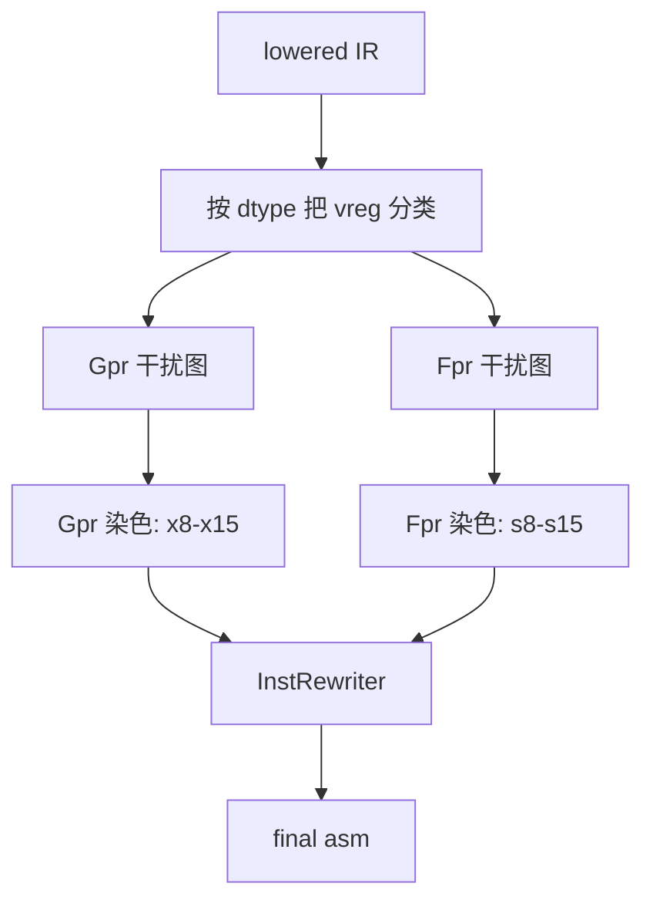

# 实验四：寄存器分配与汇编生成

## 1. 作业概述

本次实验的目标是**扩展 TeaLang 编译器的 aarch64 后端**，使浮点类型 `f32` 在源代码 → IR → 汇编 → 链接运行的全流程上跑通。具体包括：

- 新增浮点寄存器类 `Fpr`（s0–s31 / d0–d31），与既有的整数寄存器类 `Gpr` 并列；
- 新增浮点指令族 `fadd`、`fsub`、`fmul`、`fdiv`、`fcmp`、`scvtf`、`fcvtzs`、`fmov`；
- 按 AAPCS64 实现浮点参数传递（s0–s7）、浮点返回值（s0）、callee-saved 浮点寄存器（d8–d15）；
- 在干扰图染色阶段维护两个独立的干扰图，分别为整数 vreg 与浮点 vreg 着色；
- spill/reload 走对应字长的 `ldr s`/`str s`；
- phi 下降在 f32 操作数下选择 `fmov` 而非 `mov`。

### 1.1 分数构成

| 部分        | 分值    | 说明                                                                          |
| --------- | ----- | --------------------------------------------------------------------------- |
| **必做**    | 100 分 | 完成 `f32` + `as` 在 aarch64 汇编层的全部能力                                          |
| **Bonus** | 10 分  | 对 teac 后端做出有意义的改进（被合并进主分支）：如浮点常量池、SIMD 向量化、对 `f64` 的支持、对 callee-saved 寄存器维护的优化等 |

### 1.2 测试用例

本次实验**复用 asmt-3 的测试用例**，只新增运行模式：原先 `cargo test --features float` 经由 LLVM IR + `clang` 验证语义；本次实验之后，同一命令必须经由 teac 生成的 aarch64 汇编 + 系统 gcc（或交叉 gcc + QEMU）端到端跑通。

| 测试用例           | 涉及改动                                                                                                                                              |
| -------------- | ------------------------------------------------------------------------------------------------------------------------------------------------- |
| `float_basic`  | 浮点变量声明与初始化                                                                                                                                        |
| `float_arith`  | 浮点矩阵乘法（`fadd`、`fmul` 组合）                                                                                                                          |
| `float_cmp`    | 浮点比较（`fcmp ogt`/`oeq`/`oge`/`one`/`olt`/`ole`）                                                                                                    |
| `float_cast`   | `as f32` / `as i32` 双向转换                                                                                                                          |
| `float_func`   | 浮点参数 / 浮点返回值的 AAPCS64 调用约定                                                                                                                        |

asmt-3 完成后的 IR 层已经能为以上 5 个测试生成正确的 LLVM IR；本次实验把"IR → aarch64 asm"补齐。

### 1.3 交付物

修改以下文件：

- `src/asm/aarch64/types.rs` — 寄存器类与寄存器字长扩展（为 `dtype_to_regsize` 补 `F32 -> S32` 一支）
- `src/asm/aarch64/inst.rs` — 浮点指令变体
- `src/asm/aarch64/printer.rs` — 浮点指令打印
- `src/asm/aarch64/function_generator.rs` — IR → 汇编的浮点路径
- `src/asm/aarch64/register_allocator.rs` — 双干扰图分配
- `src/asm/aarch64/phi_lowering.rs` — phi 拷贝下降在 f32 上选 `fmov`
- `src/asm/common/layout.rs` — 为 `Dtype::F32` 在 `size_align_of` / `size_align_of_member` 中添加 `(size, align) = (4, 4)`

### 1.4 运行测试

```bash
# 端到端测试（必做）—— 经由 teac 汇编 + gcc 链接运行
cargo test --features float

# IR-only 模式（asmt-3 验收）—— 经由 LLVM IR + clang
cargo test --features float,asm-only

# AST-only 模式（asmt-1 验收）—— 只检查解析
cargo test --features float,ast-only

# 主线 30 个测试 + 三个免费搭车特性
cargo test
cargo test --features for-loop
cargo test --features multi-dim-array
cargo test --features struct-method
```

### 1.5 测试原理

`asmt_tests!` 宏在本次实验扩展为三层验收：

1. **AST 解析**（同 asmt-1）。
2. **IR 验证**（同 asmt-3）：在 `--features asm-only` 下保留，作为 asmt-3 验收路径。
3. **汇编端到端**（新增）：在既不打开 `ast-only` 也不打开 `asm-only` 时启用，调用 `test_single` 走 teac → aarch64 → gcc/QEMU 全链路。

handout 仅提供本作业所需的汇编层骨架，并不附带任何 asmt-1/2/3 参考实现。第 2、3 层均依赖学生自己已经完成的 IR 生成器：第 2 层产出的 LLVM IR 来自学生的 asmt-3 实现；第 3 层在第 2 层之上再多走 teac 自身的汇编生成。换言之，`--features float`、`--features float,asm-only`、`--features for-loop` 等任何会走到 IR 阶段的测试，都需要学生先完成 asmt-3 中对应的 IR 改动，否则会在 IR 生成阶段先行失败，与本作业的汇编层骨架无关。第 1 层（`--features ast-only`）只依赖 asmt-1 的语法分析。

宏内分支语义见 `tests/tests.rs` 中 `asmt_tests!` 的定义。

## 2. aarch64 浮点子系统

### 2.1 浮点寄存器架构

aarch64 中浮点/SIMD 寄存器组与整数寄存器组完全独立。本次实验涉及到的别名：

| 别名            | 字长     | 用途                                       |
| ------------- | ------ | ---------------------------------------- |
| `s0`–`s31`    | 32 位   | 单精度浮点；本作业的全部浮点指令都使用 `s` 别名               |
| `d0`–`d31`    | 64 位   | 双精度浮点（在本作业中只作为 callee-saved 表中的同义名出现）   |
| `v0`–`v31`    | 128 位  | SIMD 向量；本作业不使用                           |

AAPCS64 对浮点寄存器的约定：

- **传参寄存器**：`s0`–`s7`（第 1–8 个浮点参数），超出的浮点参数走栈。
- **返回值寄存器**：`s0`。
- **caller-saved**：`s0`–`s7`、`s16`–`s31`（除 callee-saved 之外的全部）。
- **callee-saved**：`d8`–`d15`（也即 `s8`–`s15`）。

整数寄存器的约定保持不变：传参 `x0`–`x7`、返回值 `x0`、callee-saved `x19`–`x29`。

### 2.2 浮点指令族

| 指令       | 形式                              | 含义                          |
| -------- | ------------------------------- | --------------------------- |
| `fadd`   | `fadd s_d, s_n, s_m`            | 单精度加法                       |
| `fsub`   | `fsub s_d, s_n, s_m`            | 单精度减法                       |
| `fmul`   | `fmul s_d, s_n, s_m`            | 单精度乘法                       |
| `fdiv`   | `fdiv s_d, s_n, s_m`            | 单精度除法                       |
| `fcmp`   | `fcmp s_n, s_m`                 | 单精度比较；设置条件标志位               |
| `scvtf`  | `scvtf s_d, w_n`                | 32-bit 有符号整数 → f32          |
| `fcvtzs` | `fcvtzs w_d, s_n`               | f32 → 32-bit 有符号整数（向 0 截断）  |
| `fmov`   | `fmov s_d, s_n` 或 `fmov s_d, w_n` | 浮点寄存器拷贝；或在浮点/整数寄存器之间搬位     |

浮点比较 `fcmp` 的条件标志位与整数 `cmp` 共用一个 NZCV，可直接被既有的 `b.eq`/`b.ne`/`b.lt`/`b.le`/`b.gt`/`b.ge` 复用——前提是为浮点比较选择"有序"语义的条件码（`b.mi`/`b.pl` 等少量场景例外，但本作业不涉及）。teac 在 IR 层已经把 `fcmp oeq` / `ogt` 等谓词记下，下降到汇编时直接复用 IR 的条件码即可。

## 3. 双干扰图寄存器分配

### 3.1 思路

现有的 `register_allocator.rs` 用一张干扰图为整数 vreg 染色。本次实验把分配过程拆成两条互不干扰的并行流水线：



两张图共享同一份 `defined_vregs`/`used_vregs` 信息，但活跃区间只在同类别 vreg 之间产生冲突边。结果是两组互相独立的染色结果，在最后的 `InstRewriter` 中合并查询。

可分配寄存器：

- **Gpr**：`x8`–`x15`（与既有实现一致）。
- **Fpr**：`s8`–`s15`（对应 callee-saved 的 `d8`–`d15`；选择 callee-saved 的好处是函数调用穿越时不需要在每个 `bl` 周围保存这些寄存器）。

Scratch 寄存器：

- **Gpr scratch**：`x16`–`x17`（与既有实现一致）。
- **Fpr scratch**：`s16`–`s17`（caller-saved，spill/reload 期间临时使用，函数调用不会破坏其状态。

### 3.2 vreg 分类

`Register::Virtual(idx)` 自身不携带寄存器类信息。分类策略：扫描指令流，根据指令的 dtype 字段或所在指令的字长 `RegSize` 推导每个 vreg 的类别——`RegSize::S32` 的 def/use 归入 Fpr，其余归入 Gpr。`function_generator.rs` 在发射浮点指令时必须正确填写 `RegSize::S32`，使得后续分类器看到一致的信号。

### 3.3 Spill 与 Reload

浮点 spill 槽位仍走通用的 `StackFrame::spill_slot`，但 load/store 必须使用浮点形式的 `ldr s_/str s_`，而非整数 `ldr w_/str w_`。物理 scratch 用 `s16`/`s17`。

`StackFrame` 当前的对齐策略已经满足 `S32` 的 4 字节对齐要求，不需要修改。

## 4. 为何其余三项语法特性无需 asm 层新增工作

### 4.1 多维数组

`emit_gep_array` 处理 GEP 的三种 PtrBase 形态：`Stack`（栈上数组）、`Global`（全局数组）、`Register`（来自 GEP 链的中间指针）。多维数组 `mat[i][j]` 在 IR 层下降为两条相连的 GEP；第二条 GEP 的 `base_ptr` 是第一条 GEP 的产物，类型为 `ptr_to(Array(I32, 4))`，自然走 `PtrBase::Register` 分支。`size_align_of(inner)` 对嵌套 `Array` 递归求 size，因此 `[3][4]` 与 `[3]` 的差异在 GEP 缩放系数上自动表现出来。

### 4.2 for-in 循环

IR 层在 asmt-3 把 `for i in start..end { body }` 下降为四个基本块（test / body / incr / exit），其中循环变量在循环外的 `alloca` 槽位上做 load/store，由 `mem2reg` 提升为 phi 形态。phi 节点的下降由 `phi_lowering.rs` 统一处理，与循环的源语法形态完全无关——汇编层只看到普通的基本块与 phi。`register_allocator.rs` 同样不感知循环。

### 4.3 impl 方法

IR 层在 asmt-3 把方法名 mangle 为 Itanium-ABI 风格的 `_TN<len><type><len><method>E` 形式（例如 `_TN7Counter3getE`），方法调用与普通函数调用在 IR 层共享 `Stmt::Call` 节点。汇编层 `emit_call` 通过 `Stmt::link_name` 直接发射 `bl _TN7Counter3getE`，receiver 作为普通的 `ptr` 参数走 `x0`。`self` 是普通的指针参数，asm 层完全不需要 method 概念。

## 5. 实现方案

### 5.1 `src/asm/aarch64/types.rs`

新增：

```rust
pub enum RegClass {
    Gpr,
    Fpr,
}

pub enum RegSize {
    W32,  // 32 位通用寄存器（既有）
    X64,  // 64 位通用寄存器（既有）
    S32,  // 32 位单精度浮点寄存器（新增）
}
```

`dtype_to_regsize(F32)` 返回 `S32`。

### 5.2 `src/asm/aarch64/inst.rs`

新增指令变体：

```rust
Inst::FBinOp { op, dst, lhs, rhs }   // op ∈ { FAdd, FSub, FMul, FDiv }
Inst::FCmp   { lhs, rhs }
Inst::Scvtf  { dst, src }
Inst::Fcvtzs { dst, src }
Inst::Fmov   { dst, src }
```

`used_vregs` 与 `defined_vregs` 中加入对应分支。

### 5.3 `src/asm/aarch64/printer.rs`

每个新指令对应一条 `writeln!` 调用，按 2.2 节给出的形式发射。

### 5.4 `src/asm/aarch64/function_generator.rs`

- `lower_float`：把 IR 中的浮点操作数下降为汇编操作数。
- `lower_value` 的 `F32` 分支：返回 `(Operand, RegSize::S32)`。
- `emit_call_reg_arg` / `emit_call_stack_arg`：浮点参数走 `s0`–`s7`、超出走栈。
- `emit_call_result`：`F32` 返回时把 `s0` 拷贝到目标 vreg。
- `emit_return`：返回 f32 时把值搬到 `s0`。
- `emit_stmt`：`FBiOp`、`FCmp`、`SIToFP`、`FPToSI` 各自下降为对应汇编指令。

### 5.5 `src/asm/aarch64/register_allocator.rs`

- 新增 `ALLOCATABLE_FPRS: [u8; 8] = [8, 9, 10, 11, 12, 13, 14, 15]`。
- `allocate()` 拆成两条独立的染色流水线：先按 vreg 类别分桶，再分别构建干扰图、跑 simplify/select，最后合并两份 `coloring`。
- `InstRewriter` 在 spill/reload 时按 vreg 类别选择 `ldr s_/str s_` 或 `ldr w_/str w_`。

### 5.6 `src/asm/aarch64/phi_lowering.rs`

`emit_copy` 在 src/dst 的 dtype 为 `F32` 时使用 `Fmov`；其余情况保持 `Mov`。

## 6. 提交检查

- `cargo test --features float` 全部 5 项通过（端到端：teac asm + gcc + run）。
- `cargo test --features float,asm-only` 全部 5 项通过（保留 asmt-3 的 IR-only 验收路径）。
- `cargo test --features for-loop` / `--features multi-dim-array` / `--features struct-method` 各 5 项通过（验证三项免费搭车）。
- `cargo test --features return-type-inference` 仍 35 项通过。
- `cargo test` 主线 30 项端到端不退化。
